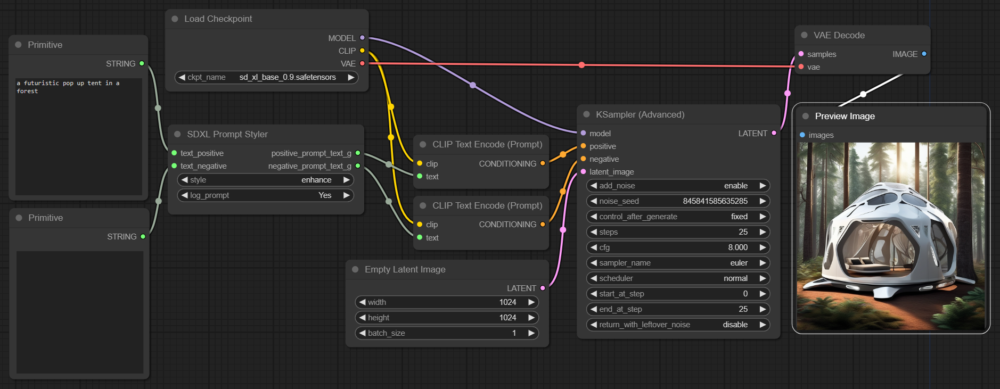

# SDXL Prompt Styler 简体中文版

声明：我并不是SDXL Prompt Styler的作者，我只是做了汉化，原作者在[SDXL Prompt Styler](https://github.com/twri/sdxl_prompt_styler)

我做的其他汉化内容：

- ComfyUI界面汉化详见：[ComfyUI 简体中文版](https://github.com/ZHO-ZHO-ZHO/ComfyUI-ZHO-Chinese)

- ComfyUI Manager汉化详见：[ComfyUI-Manager 简体中文版](https://github.com/ZHO-ZHO-ZHO/ComfyUI-Manager-Zh-Chinese)


-----------------

SDXL Prompt Styler
=======
Custom node for ComfyUI
-----------


SDXL Prompt Styler is a node that enables you to style prompts based on predefined templates stored in a JSON file. The node specifically replaces a {prompt} placeholder in the 'prompt' field of each template with provided positive text.

The node also effectively manages negative prompts. If negative text is provided, the node combines this with the 'negative_prompt' field from the template. If no negative text is supplied, the system defaults to using the 'negative_prompt' from the JSON template. This flexibility enables the creation of a diverse and specific range of negative prompts.

### Usage Example with SDXL Prompt Styler

Template example from a JSON file:

```json
[
    {
        "name": "base",
        "prompt": "{prompt}",
        "negative_prompt": ""
    },
    {
        "name": "enhance",
        "prompt": "breathtaking {prompt} . award-winning, professional, highly detailed",
        "negative_prompt": "ugly, deformed, noisy, blurry, distorted, grainy"
    }
]
```

```python
style = "enhance"
positive_prompt = "a futuristic pop up tent in a forest"
negative_prompt = "dark"
```

This will generate the following styled prompts as outputs:

```
breathtaking a futuristic pop up tent in a forest . award-winning, professional, highly detailed
ugly, deformed, noisy, blurry, distorted, grainy, dark
```

### Installation

To install and use the SDXL Prompt Styler nodes, follow these steps:

1. Open a terminal or command line interface.
2. Navigate to the `ComfyUI/custom_nodes/` directory.
3. Run the following command:
```git clone https://github.com/twri/sdxl_prompt_styler.git```
4. Restart ComfyUI.

This command clones the SDXL Prompt Styler repository into your `ComfyUI/custom_nodes/` directory. You should now be able to access and use the nodes from this repository.

### Inputs

* **text_positive** - text for the positive base prompt G
* **text_negative** - text for the negative base prompt G
* **log_prompt** - print inputs and outputs to stdout

### Outputs

* **positive_prompt_text_g** - combined prompt with style for positive promt G
* **negative_prompt_text_g** - combined prompt with style for negative promt G
